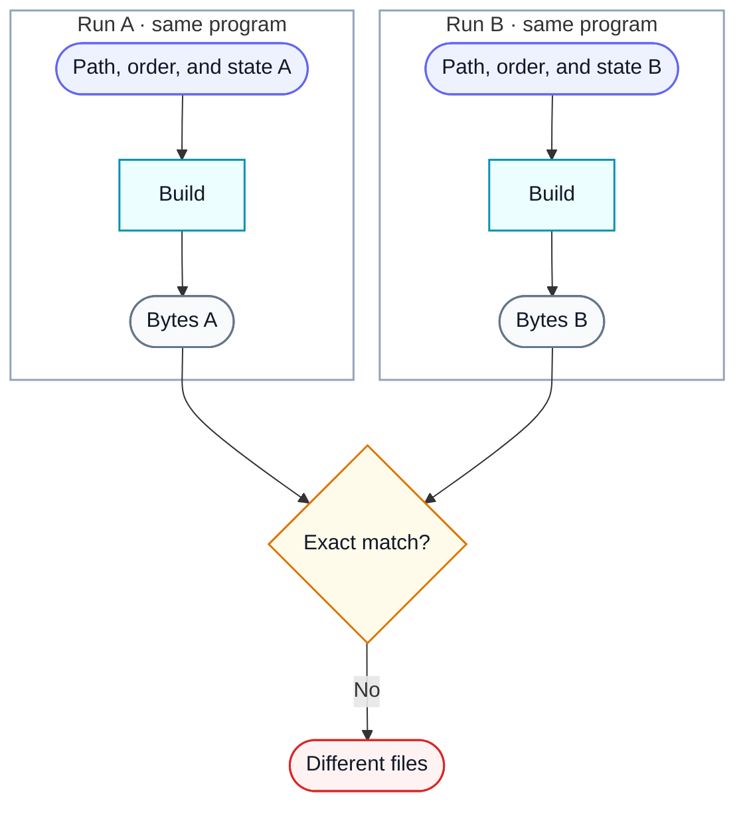
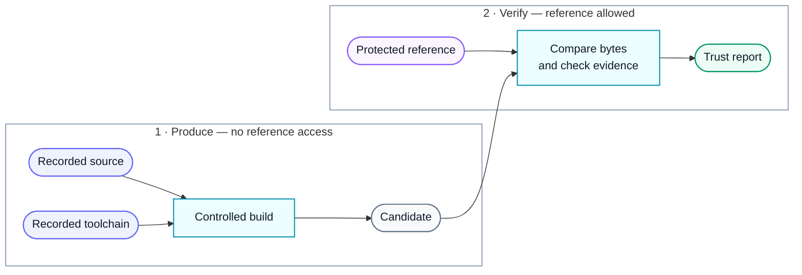
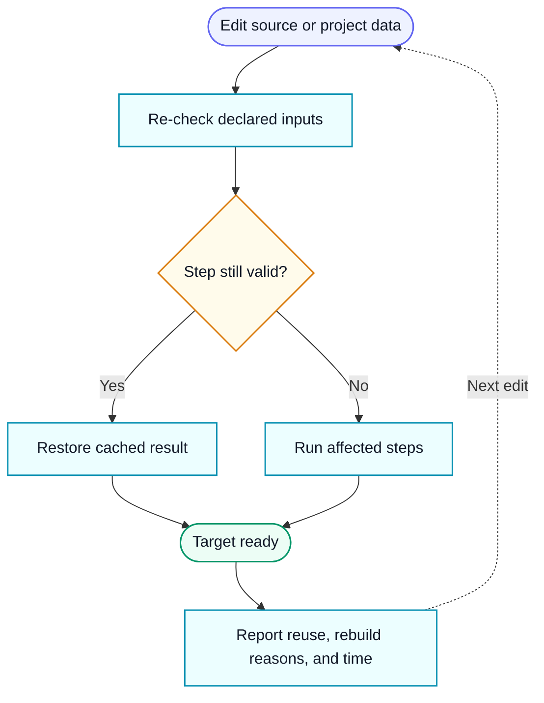

<p align="center">
  
</p>

<h1 align="center">ReproBit</h1>

**Rebuild old software exactly—and show why the result can be trusted.**

ReproBit helps decompilation projects reproduce an original executable byte for byte with its
original compiler. It controls the small, often invisible details that make an old toolchain emit
different bytes, then records how every output was made.

The result is more than a matching checksum. ReproBit checks three separate claims:

1. the rebuilt file is literally identical to the reference file;
2. every special adjustment used to reach that match preserved the program's logic; and
3. the rebuilt program came from the declared source and toolchain, not bytes copied from the
   original executable.

ReproBit is pre-release software. It recognizes profiles for Microsoft Visual C++ 4.2 and the
5.0 releases. Current end-to-end evidence with the real compiler and native Windows CI covers
4.2; the 5.0 profiles are modeled, but do not yet carry equivalent end-to-end proof. The shared
build, verification, reporting, and incremental pieces are designed to support more compiler
families through reviewed library releases.

## Install and set up the pre-release

You need Python 3.11 or newer and Git. The one-time CMake import also needs your
project's compatible CMake version on `PATH`. On macOS and Linux, install Wine
and `wineserver`; native Windows does not use Wine.

```console
git clone https://github.com/isledecomp/reprobit.git
cd reprobit
python -m venv .venv
source .venv/bin/activate
python -m pip install .
rbit --version
```

In Windows PowerShell, replace the activation line with:

```powershell
.\.venv\Scripts\Activate.ps1
```

Then run the same `python -m pip install .` and `rbit --version` commands. Keep
the environment active while using `rbit` in your own project.

ReproBit runs with Wine on macOS and Linux and natively on Windows. It can fetch and authenticate
the supported MSVC 4.2 files from the pinned archaic-msvc repositories, or use an existing local
installation. Reference binaries remain project-owned and are never redistributed by ReproBit.

### Project setup outline

From an existing CMake project directory, create the ReproBit records and
prepare the current machine. Name the real CMake target at initialization:

```console
rbit init . --target program
rbit setup .
rbit source preview .
rbit source lock .
# Put the reference binary at reference/program.exe, then:
rbit import cmake .
rbit status .
```

`init` creates the project entry point, ignores ReproBit's local state, and creates an empty,
explicitly incomplete source record. `setup`
downloads the compiler when needed, authenticates it, remembers its location, creates or checks
the project lock, and tests the host. The two source commands show and then lock the Git-tracked
files the build may read. `import cmake` creates a small reviewable build plan, records reference
metadata, configures the existing CMake project once, and saves the direct compiler and linker
steps. It also creates an empty review file for each unambiguous source file, so discovery can
start without hand-authored JSON. It does not edit `CMakeLists.txt`, and normal ReproBit builds
never invoke CMake. Repeat `--target` when the project produces more than one binary; the default
rebuilt-output and reference filenames follow each target name. For target-specific custom paths,
repeat `--artifact TARGET=PATH` or `--oracle TARGET=PATH`.
For a target with a custom output name, declare both the rebuilt artifact and reference binary
paths with `--artifact` and `--oracle`, for example:

```console
rbit init . --target game --artifact build/GAME.EXE --oracle reference/GAME.EXE
```

Pass `--toolchain-root /path/to/msvc42` to `setup` when using an existing installation. `status`
shows the next incomplete step instead of requiring you to remember the sequence. The
[command-line workflow](docs/cli.md) explains the generated project records, while
[platform setup](docs/platforms.md) and the
[native Windows guide](docs/windows.md) cover unusual hosts.

Once those files are committed, the everyday build and check commands are:

```console
rbit validate .
rbit build .
rbit verify . --report-dir build/reprobit-report
```

Open `build/reprobit-report/report.html` in a browser. Its first view explains
the overall result and each target; detailed symbols, commands, and evidence are
available in collapsed Advanced sections.

The declared binary remains the only output used for byte-exact certification
or release. If an imported MSVC link asks for debug data, ReproBit also writes a
matched binary and `.PDB` under the sibling `reprobit-debug/` directory—for
example, `build/reprobit-debug/GAME.EXE` and
`build/reprobit-debug/GAME.PDB`. Give analysis tools those two files together.
ReproBit chooses the paths automatically and caches the pair during incremental
builds. If the project uses reviewed source adjustments, export the matching
source view before running a source-aware comparison tool:

```console
rbit source export build/reprobit-debug/source
```

Point the tool's source root at that directory. This keeps its line and symbol
information matched to the files the compiler actually read. Run the same
command after later changes; ReproBit safely replaces the previous source view
and removes files that are no longer part of it.

After editing a file that is already part of the project—even a shared header
used by many source files—let ReproBit repair and verify the project in one
step:

```console
rbit repair .
```

This is the maintenance path after the project has already reached an exact
match. If a new project builds but does not match yet, start with the bounded
[`discover grind` workflow](docs/discovery.md) to find its first adjustments.
`repair` works on a private copy first. It updates the saved build guidance
affected by your edit, rebuilds every target from scratch, and checks that the
result is still exact and trustworthy. Only then does it publish the updated
project records, verified binaries, matching debug companions, and JSON/HTML
report together. If repair cannot prove the result, your source edit is kept
while the saved records and previously published results stay unchanged. See
[Repair after source edits](docs/cli.md#repair-after-source-edits) for report
paths, cleanup, and the advanced preview tool.

To add a new file to the reviewed source list—or remove a locked one—start with
`rbit source preview .`; repair never silently admits newly tracked
files. Preview prints a safe `source lock` command when existing build records
still apply. Lock then prints the next required step—usually placing the
original binary, importing CMake, or checking status. If the change affects
which files CMake builds, ReproBit currently
refuses the update instead of risking saved interventions; restore the previous
file list for now. Re-run `rbit import cmake .` only when a successful source
lock asks for it.

Failed builds keep a private workspace so problems can be inspected. Reclaim
those workspaces with `rbit clean .`; the reusable build cache is kept by
default. `rbit state status .` points out cache data the current ReproBit version
cannot reuse. Include it when cleaning inactive workspaces with
`rbit clean . --obsolete-cache --preview`; the current cache is kept. Use
`--cache` to clear the complete cache, or `--reports` to remove generated
verification and grind reports.

ReproBit uses the remembered authenticated compiler and the locked host launchers. CI can still
pass explicit machine paths and emit NDJSON. Use `rbit build . --cold` for a non-certifying
developer build with no cache reads or writes.

## Why exact rebuilds are difficult

Two builds can behave the same and still produce different files. Older compilers may let source
paths, declaration order, object order, debug history, temporary filenames, library scan order,
or other incidental state influence the output. We call that **compiler entropy**: information
that is not part of the program's intended behavior but still changes its bytes.



_In words: equivalent source can produce different binary files when incidental compiler inputs
change._

ReproBit turns those hidden influences into declared, repeatable build inputs. When a project
needs a small intervention to guide the compiler, it must use one of ReproBit's reviewed,
versioned operations and pass that operation's current-run checks. Project files describe the
work as data; they cannot inject arbitrary Python into a certified build.

## The LEGO Island reference case

ReproBit grew out of byte-identity work on the
[LEGO Island decompilation](https://github.com/isledecomp/isle). That project rebuilds a 1997 game
with Microsoft Visual C++ 4.2. It illustrates the gap between two important finish lines:

- **Complete decompilation:** the recovered C++ behaves like the original game.
- **Byte-identical decompilation:** the old compiler also emits the exact original executable and
  DLL, down to every byte.

A function can be logically correct while compiler bookkeeping places or describes it
differently. Paths that were visible to the compiler in 1997 matter. So can declaration order,
shared debug state, parallel compiler processes, and link order.
For a visual explanation, the LEGO Island development video covers
[compiler entropy starting at 9:03](https://youtu.be/gthm-0Av93Q?t=543s).
The campaign exposed these issues at real-project scale; ReproBit packages the resulting controls
and checks into a reusable library. The project's source, targets, and interventions remain in the
decompilation repository rather than being built into ReproBit.

## What a clean result means

A matching file alone cannot reveal whether someone copied bytes from the original, reused stale
output, or made an unverified source change. ReproBit therefore reports independent answers:

- **Byte exact:** candidate and reference have the same bytes.
- **Logic certified:** each non-ordinary adjustment passed its specific preservation checks in
  this run.
- **Toolchain origin:** the program's own code and data can be traced back to declared outputs of
  the compiler, resource compiler, librarian, and linker.

In the clean path, the part that produces the candidate cannot read the reference file. A
separate verifier receives the finished candidate and the protected reference only after
production, performs the literal comparison, and writes the report.



_In words: on the clean path, the reference binary is available only to the final verifier, never
as material for the producer._

A verdict is **clean** only when all three claims pass, the verification build starts from scratch,
and no quarantined reference-byte exception runs. See the
[authenticity model](docs/authenticity.md) for the exact guarantees and trust boundary.

## Fast enough for everyday iteration

Exact verification should be strict; editing should still feel ordinary. `rbit build` is an
incremental developer build. It reuses a stored result only when every relevant input still
matches, then rebuilds the affected compiler steps and their downstream archive or link steps.
An unchanged build can finish without starting the compiler environment at all. Affected work can
run in parallel, while separate work areas keep compiler scratch and debug state from leaking
between jobs.

`rbit verify` is deliberately different: it always builds from scratch and never treats
the developer cache as certification evidence.



_In words: each edit invalidates only the dependent work; the CLI explains what it reused and
what it rebuilt._

Interactive terminals get a progress bar with elapsed time. Redirected text logs receive regular
heartbeats, and `rbit --format ndjson ...` emits stable machine-readable progress events for CI
and other tools. The [GitHub Action](docs/action.md) runs the build-from-scratch verification
workflow and exports the individual authenticity results.

## Measure how much help the build needs

ReproBit assigns a **cost** to each entropy intervention. The score measures distance from an
ordinary build, not runtime or money: harmless compiler-state declarations are cheap, while
donors, semantic rewrites, and binary transformations cost progressively more. The ideal score is
zero—the checked-in source, built normally by the original toolchain, already matches.

```console
rbit cost .
rbit explain . --intervention intervention-id
```

Costs make remaining compromises visible and give contributors a concrete way to simplify a
project over time. See the [cost model](docs/costs.md) for the fixed categories and accounting
rules.

## Project files

ReproBit keeps the reusable machinery in this package and project-specific facts beside the
decompilation source:

```text
reprobit.toml
reprobit/
  source-manifest.json
  toolchain.lock.json
  build-plan.json
  producer-graph.json
  interventions/
  proofs/
  oracles/
```

The [project format](docs/project-format.md) explains each file. Large intervention and proof sets
can be split into small reviewable documents.

## Documentation

Start here:

- [Runnable examples](examples/README.md)
- [Command-line workflow](docs/cli.md)
- [Find possible compiler interventions](docs/discovery.md)
- [GitHub Action](docs/action.md)
- [Troubleshooting](docs/troubleshooting.md)

Detailed references:

- [Authenticity and threat model](docs/authenticity.md)
- [Project format](docs/project-format.md)
- [Cost model](docs/costs.md)
- [Platforms and logical paths](docs/platforms.md)
- [Native Windows and external MSVC setup](docs/windows.md)
- [One-time CMake import](docs/cmake.md)
- [Architecture](docs/architecture.md)

## Development

```console
python -m pip install -e '.[test]'
pytest
ruff check src tests
mypy src/reprobit
```

ReproBit is licensed under `LGPL-3.0-only`.
