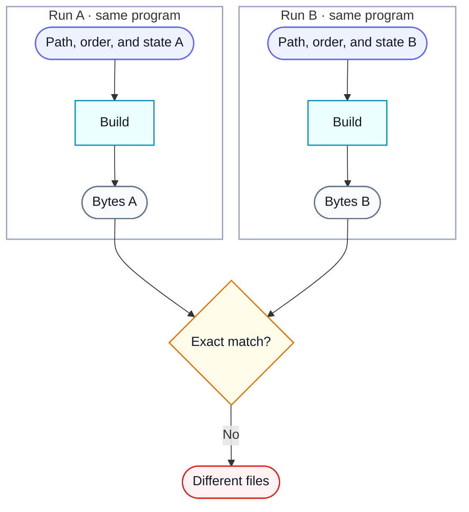
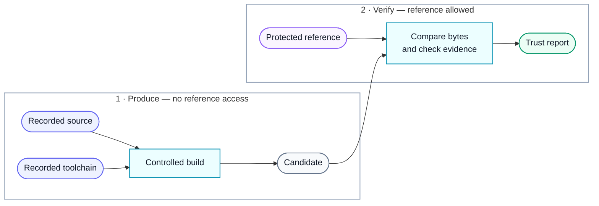
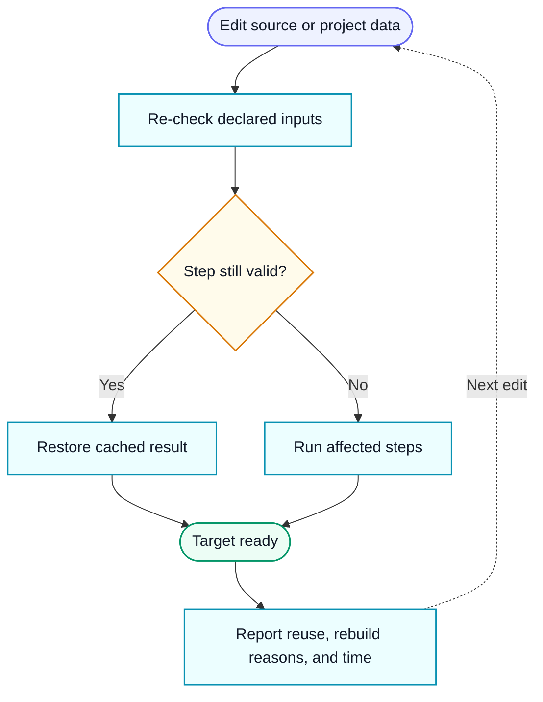

# Concepts

This page explains what ReproBit is protecting against and what its verdicts
mean. It is background reading; [Getting started](getting-started.md) is the
hands-on path and the [command-line reference](cli.md) documents each command.
The [glossary](glossary.md) defines the terms used here.

## Why exact rebuilds are difficult

Two builds can behave the same and still produce different files. Older compilers may let source
paths, declaration order, object order, debug history, temporary filenames, library scan order,
or other incidental state influence the output. We call that **compiler entropy**: information
that is not part of the program's intended behavior but still changes its bytes.



_In words: equivalent source can produce different binary files when incidental compiler inputs
change._

ReproBit turns those hidden influences into declared, repeatable build inputs. When a project
needs a small intervention to guide the compiler, it must use one of ReproBit's reviewed,
versioned operations and pass that operation's current-run checks. Project files describe the
work as data; they cannot inject arbitrary Python into a certified build.

## What a clean result means

A matching file alone cannot reveal whether someone copied bytes from the original, reused stale
output, or made an unverified source change. ReproBit therefore reports independent answers:

- **Byte exact:** candidate and reference have the same bytes.
- **Logic certified:** each non-ordinary adjustment passed its specific preservation checks in
  this run.
- **Toolchain origin:** the program's own code and data can be traced back to declared outputs of
  the compiler, resource compiler, librarian, and linker.

In the clean path, the part that produces the candidate cannot read the reference file. A
separate verifier receives the finished candidate and the protected reference only after
production, performs the literal comparison, and writes the report.



_In words: on the clean path, the reference binary is available only to the final verifier, never
as material for the producer._

A verdict is **clean** only when all three claims pass, the verification build starts from scratch,
and no quarantined reference-byte exception runs. See the
[authenticity model](authenticity.md) for the exact guarantees and trust boundary.

## Fast enough for everyday iteration

Exact verification should be strict; editing should still feel ordinary. `rbit build` is an
incremental developer build. It reuses a stored result only when every relevant input still
matches, then rebuilds the affected compiler steps and their downstream archive or link steps.
An unchanged build can finish without starting the compiler environment at all. Affected work can
run in parallel, while separate work areas keep compiler scratch and debug state from leaking
between jobs.

`rbit verify` is deliberately different: it always builds from scratch and never treats
the developer cache as certification evidence.



_In words: each edit invalidates only the dependent work; the CLI explains what it reused and
what it rebuilt._

Interactive terminals get a progress bar with elapsed time. Redirected text logs receive regular
heartbeats, and `rbit --format ndjson ...` emits stable machine-readable progress events for CI
and other tools. The [GitHub Action](action.md) runs the build-from-scratch verification
workflow and exports the individual authenticity results.

## Measure how much help the build needs

ReproBit assigns a **cost** to each entropy intervention. The score measures distance from an
ordinary build, not runtime or money: harmless compiler-state declarations are cheap, while
donors, semantic rewrites, and binary transformations cost progressively more. The ideal score is
zero—the checked-in source, built normally by the original toolchain, already matches.

```console
rbit cost .
rbit explain . --intervention intervention-id
```

Costs make remaining compromises visible and give contributors a concrete way to simplify a
project over time. See the [cost model](costs.md) for the fixed categories and accounting
rules.

## Project files

ReproBit keeps the reusable machinery in this package and project-specific facts beside the
decompilation source:

```text
reprobit.toml
reprobit/
  source-manifest.json
  toolchain.lock.json
  build-plan.json
  producer-graph.json
  interventions/
  proofs/
  oracles/
```

The [project format](project-format.md) explains each file. Large intervention and proof sets
can be split into small reviewable documents.
